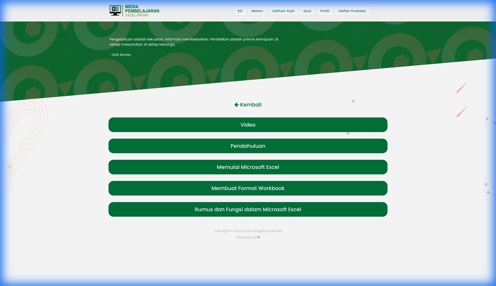
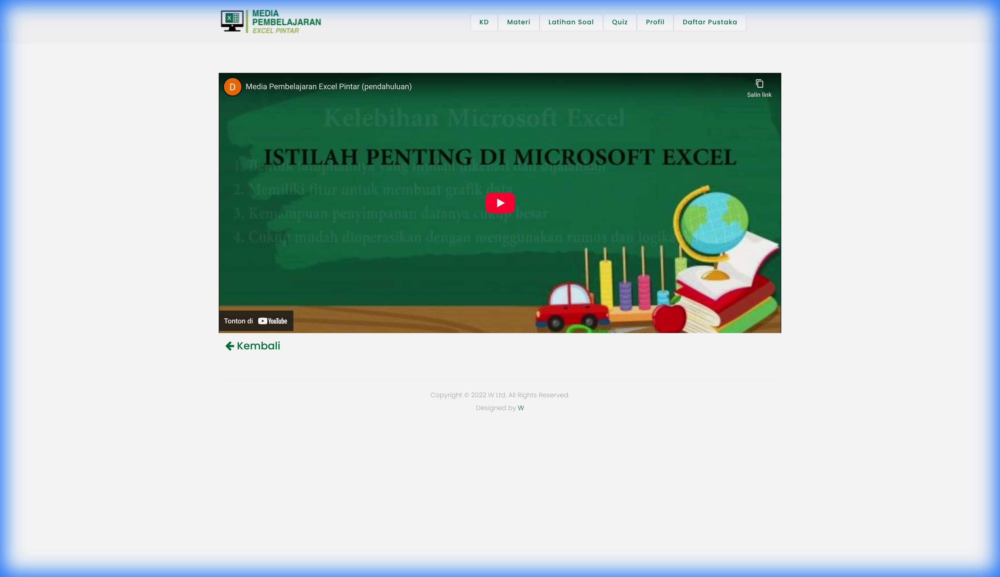
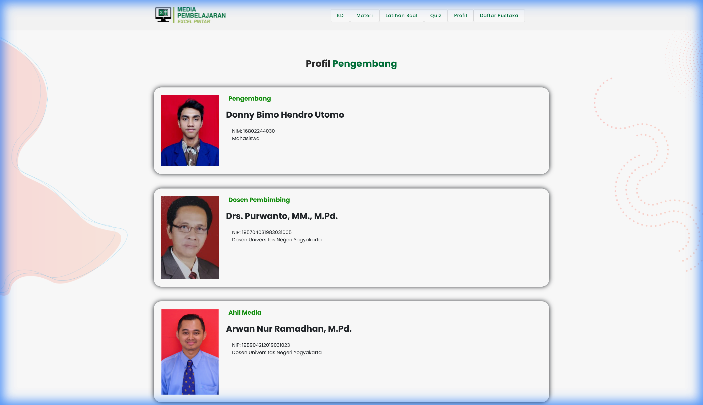
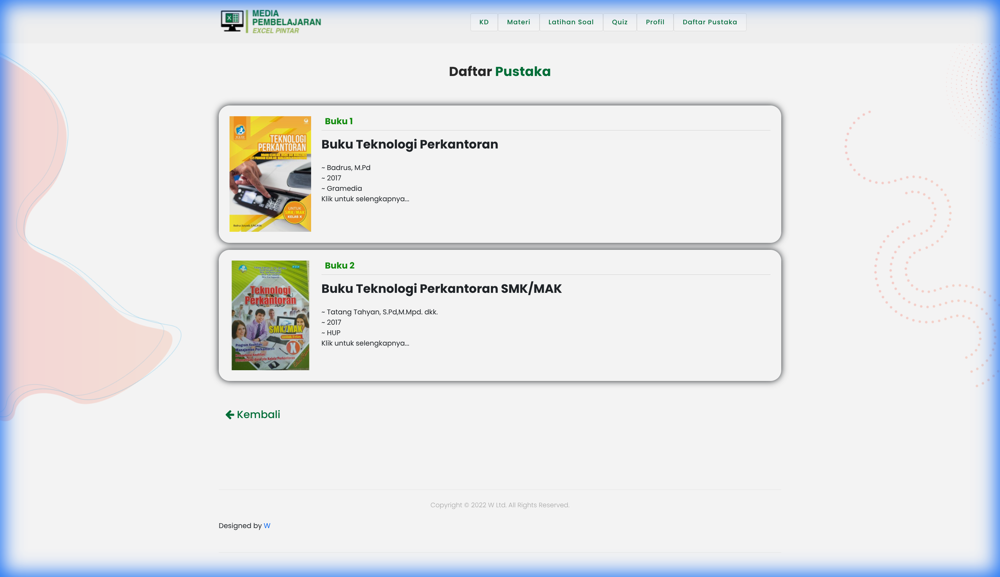

# ExcelPintar - Media Pembelajaran

ExcelPintar adalah aplikasi media pembelajaran berbasis web yang dirancang untuk membantu siswa memahami dasar-dasar pengoperasian Microsoft Excel. Aplikasi ini menyajikan materi secara interaktif, lengkap dengan video, latihan soal, dan kuis evaluasi.

## Fitur Utama

Berikut adalah fitur-fitur utama yang tersedia dalam aplikasi ini:

### 1. Halaman Utama (Landing Page)
Halaman awal yang menyambut pengguna dengan antarmuka yang bersih dan navigasi menu yang mudah diakses.

### 2. Kompetensi Dasar (KD)
Menampilkan informasi mengenai Kompetensi Dasar (3.4 & 4.4), Indikator Pencapaian Kompetensi, dan Tujuan Pembelajaran yang ingin dicapai.

### 3. Materi Pembelajaran
Modul pembelajaran lengkap yang mencakup pengenalan Excel, cara memulai, pembuatan format workbook, hingga penggunaan rumus dan fungsi.

#### Video Pembelajaran
Dilengkapi dengan video tutorial untuk memudahkan pemahaman siswa secara visual.

### 4. Latihan Soal
Bagian ini menyediakan latihan praktis untuk mengasah kemampuan siswa dalam menerapkan materi yang telah dipelajari.

### 5. Quiz Interaktif
Evaluasi pemahaman siswa melalui kuis interaktif yang dapat dikerjakan secara langsung.

### 6. Profil Pengembang
Informasi mengenai tim pengembang dan pembimbing di balik pembuatan media pembelajaran ini.

### 7. Daftar Pustaka
Referensi dan sumber belajar yang digunakan dalam penyusunan materi aplikasi ini.

## Cara Menggunakan

Aplikasi ini berbasis web statis, sehingga dapat dijalankan dengan mudah:

1.  **Online**: Kunjungi [Link Demo](https://widifirmaan.github.io/ExcelPintar-Media-Pembelajaran/).
2.  **Offline**:
    *   Clone atau download repository ini.
    *   Buka file `index.html` menggunakan browser modern (Chrome, Firefox, Edge, dll).

## Tim Pengembang

*   **Project Untuk**: Donny Bimo Hendro Utomo
*   **Pembimbing**: Drs. Purwanto, MM., M.Pd.
*   **Ahli Media**: Arwan Nur Ramadhan, M.Pd.

